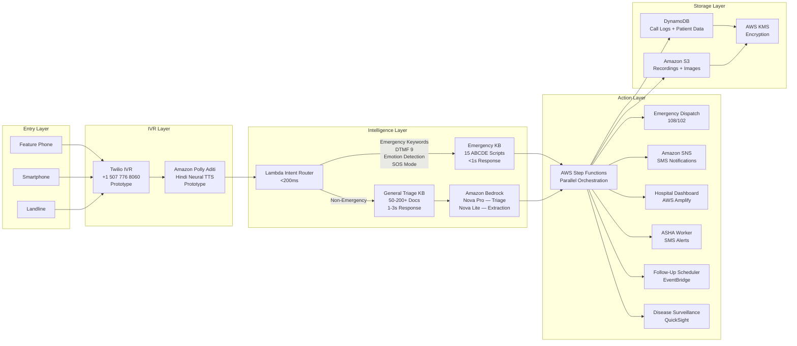
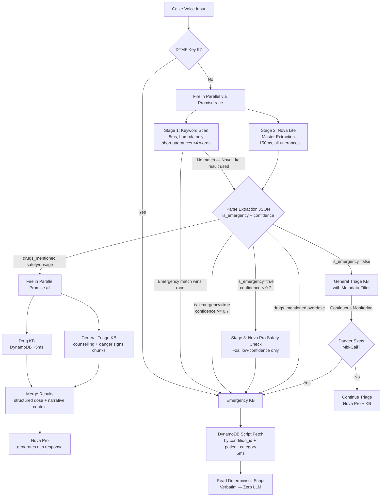
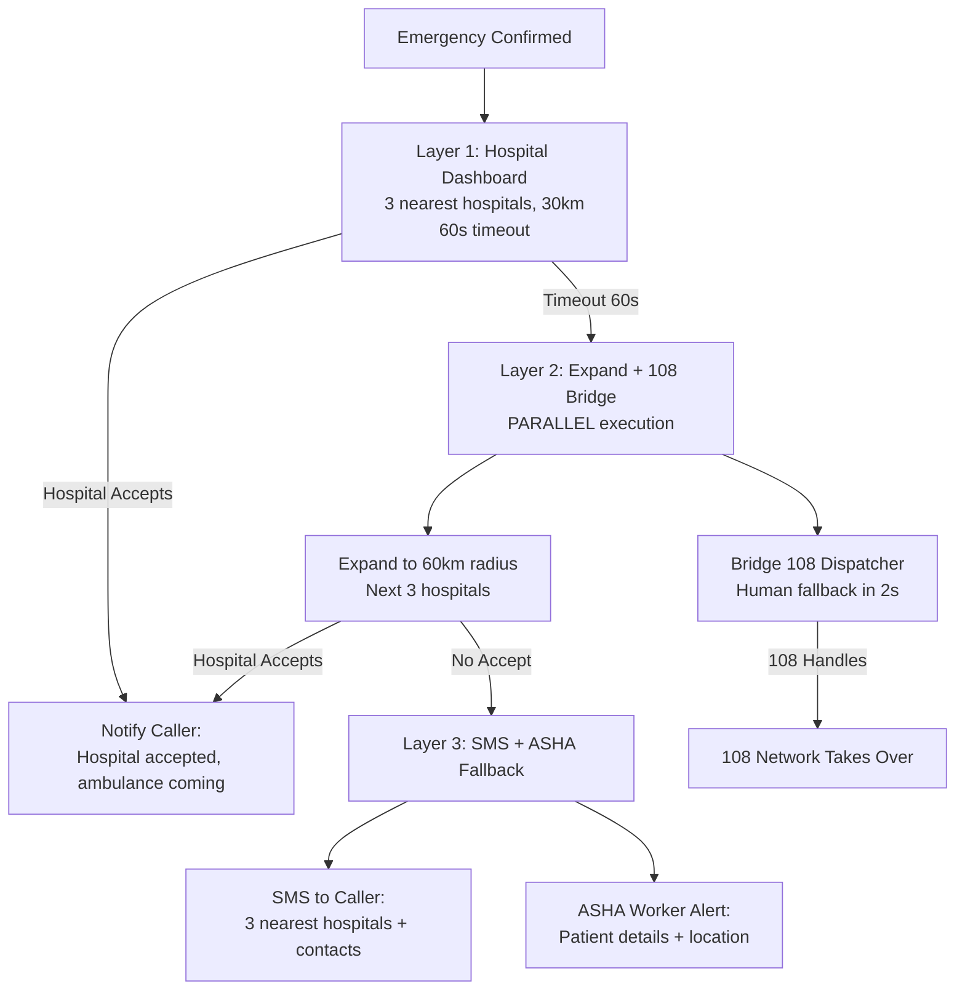

# Design Document: VaidyaVaani IVR Health Assistant

## Overview

VaidyaVaani is an AI-powered IVR health assistant built entirely on AWS services. The prototype receives phone calls via Twilio (number: +1 507 776 8060), processes speech using Amazon Polly Aditi voice (Hindi neural TTS), classifies intent via a 3-stage Lambda cascade (keyword scan → Nova Lite Master Extraction → Nova Pro safety check), and routes to one of three knowledge bases: a deterministic Emergency Protocol KB (~15 ABCDE scripts in DynamoDB), a structured Drug KB (DynamoDB, NLEM medicines), or an intelligent General Triage KB (RAG over ICMR/WHO protocols via Bedrock). The production architecture uses Amazon Connect + Nova 2 Sonic — blocked on AISPL during hackathon (see BLOCKERS-AND-DECISIONS.md).

The design prioritizes:
- **Zero hallucination** for emergencies (deterministic scripts read verbatim)
- **Sub-second emergency response** (<1s for Emergency KB, 1-3s for General Triage KB)
- **Feature phone compatibility** (pure IVR, no internet/app required)
- **3-layer emergency fallback** (hospital dashboard → 108 bridge → SMS/ASHA)
- **3-tier location detection** (voice → phone prefix → SMS GPS)

## Architecture

### High-Level Architecture



### Intent Classification & Routing Flow

The routing pipeline uses a **3-stage cascade** to balance speed and accuracy:

- **Stage 1 — Keyword Scan (5ms):** Pure Lambda keyword matching. Catches ~80% of emergencies instantly. No LLM call.
- **Stage 2 — Nova Lite Master Extraction (150ms):** If no keyword match, a single Nova Lite call extracts a structured JSON tag set that routes both emergency and general triage paths simultaneously.
- **Stage 3 — Nova Pro General Triage (2-3s):** Only for non-emergency, ambiguous, or low-confidence cases.



#### Master Extraction JSON (Nova Lite output)

```json
{
  "is_emergency": true,
  "condition_id": "cardiac|snakebite|child_fever|breathing_difficulty|general_fever|maternal_care|chronic_disease|drug_query|unknown",
  "patient_profile": {
    "category": "pediatric|adult|maternal|geriatric|unknown",
    "exact_age_mentioned": "2 years | null",
    "pregnancy_flag": "confirmed|possible|not_applicable|unknown"
  },
  "clinical_symptoms_english": ["chest pain", "left arm numbness"],
  "drugs_mentioned": [
    { "name": "paracetamol", "query_type": "safety|dosage|overdose|availability" }
  ],
  "severity_signal": "critical|urgent|mild",
  "duration": "sudden onset | null",
  "location_mentioned": "Khedi village | null",
  "danger_signs_present": ["unconscious", "not_breathing"],
  "confidence": 0.95
}
```

**`condition_id` routing split:**
- Emergency DynamoDB path: `cardiac`, `snakebite`, `child_fever`, `breathing_difficulty`
- Bedrock KB path: `general_fever`, `maternal_care`, `chronic_disease`, `drug_query`, `unknown`
- `drug_query` — caller has no symptom, only a drug question (e.g., "Is paracetamol safe in pregnancy?")
- All non-emergency `condition_id` values feed QuickSight analytics — no more 95% "none" in the dashboard

**`CONFIDENCE_THRESHOLD = 0.7`** — named constant used in all routing logic below. Below this value, Nova Pro safety check is triggered before DynamoDB fetch.

**Routing logic from JSON:**
- `is_emergency=true` + `confidence >= CONFIDENCE_THRESHOLD` → DynamoDB fetch by `condition_id` + `patient_profile.category`
- `is_emergency=true` + `confidence < CONFIDENCE_THRESHOLD` → Nova Pro safety check before DynamoDB
- `drugs_mentioned[].query_type = "overdose"` → Emergency path immediately, regardless of `is_emergency`
- `drugs_mentioned[].query_type = "safety|dosage"` → **Dual-source parallel query:**
  - Drug DB (DynamoDB) → exact dose, contraindications, pregnancy category (~5ms)
  - General Triage KB (Bedrock) → counselling + danger signs chunks filtered by `patient_profile.category` + `condition` (~200-500ms)
  - Both fire via `Promise.all()` — total latency = KB latency (~500ms), Drug DB result waits
  - Merged context passed to Nova Pro for rich response generation
- `is_emergency=false` → `clinical_symptoms_english` used as KB query, `patient_profile.category` used as metadata filter
- `danger_signs_present` non-empty → mid-call escalation trigger regardless of `is_emergency` (Requirement 2.6)
- `pregnancy_flag = "confirmed"|"possible"` → maternal protocols only, never adult male dosages

#### Emergency Script DynamoDB Schema

```
Table: vaidyavaani-emergency-scripts
Primary Key: condition_id (String)
Sort Key:    patient_category (String)

Examples:
  cardiac    + adult     → { abcde_script, icd10: "I21.9", dispatch: "108", ... }
  cardiac    + geriatric → { abcde_script (modified for elderly), ... }
  snakebite  + adult     → { abcde_script, myth_busting, icd10: "T63.0", ... }
  child_fever + pediatric → { abcde_script, ORS instructions, icd10: "A09", ... }
```

Scripts are read **verbatim** — zero LLM generation. CPR instructions for infants differ from adults. This schema enforces that separation.

### Emergency Dispatch 3-Layer Fallback



### 3-Tier Location Detection

```mermaid
graph TD
    CALL[Call Starts] --> T2[Tier 2: Auto-extract from phone number<br/>Landline: STD code → city/district<br/>Mobile: prefix4 → telecom circle/state<br/>100% capture, zero user input]
    T2 --> NEED{Location Needed?}
    NEED -->|Emergency| T1[Tier 1: Voice Input<br/>"Aap kahan hain?"<br/>Village/Landmark, 85-90% capture]
    NEED -->|Non-Emergency| T1
    T1 -->|Caller Responds| STORE[Store Location in DynamoDB]
    T1 -->|Caller Cannot Speak| FALLBACK[Use Tier 2 Data]
    FALLBACK --> STORE
    STORE --> SMART{Smartphone?}
    SMART -->|Yes| T3[Tier 3: SMS GPS Link<br/>GPS-level, 10-50m accuracy]
    SMART -->|No| DONE[Location Complete]
    T3 --> DONE
```

## Components and Interfaces

### 1. IVR_System (Prototype: Twilio / Production: Amazon Connect)

**Responsibility:** Manages all inbound/outbound calls, DTMF handling, call routing, and missed call callback.

**Interfaces:**
- `receiveCall(callerNumber: string, callId: string): CallSession` — Answers incoming call, creates session
- `playGreeting(callId: string, language: Language): void` — Plays welcome message with language selection
- `handleDTMF(callId: string, key: number): DTMFAction` — Processes keypad input
- `bridgeCall(callId: string, targetNumber: string): void` — Bridges caller to 108 dispatcher
- `initiateOutboundCall(targetNumber: string, purpose: CallPurpose): CallSession` — For follow-ups
- `handleMissedCall(callerNumber: string): void` — Triggers callback for zero-cost access

#### Twilio TwiML Webhook Flow (Prototype)

Every Twilio webhook call is stateless HTTP. The conversation state must be persisted externally between turns. Here is the complete request/response cycle:

```
Turn 1 — Incoming call:
  Twilio POST → API Gateway → Lambda
  Body: CallSid, From, To, CallStatus="ringing"
  Lambda returns TwiML:
    <Response>
      <Say voice="Polly.Aditi">VaidyaVaani. Apni takleef batayein. For English, press 2.</Say>
      <Gather input="speech dtmf" timeout="5" speechTimeout="auto"
              action="/gather" method="POST" language="hi-IN">
      </Gather>
    </Response>

Turn 2 — Caller speaks or presses key:
  Twilio POST → API Gateway → Lambda (/gather endpoint)
  Body: CallSid, SpeechResult="seene mein dard hai", Digits="" (or vice versa)
  Lambda:
    1. Load ConversationState from DynamoDB by CallSid
    2. Run intent routing (keyword scan + Nova Lite in parallel)
    3. Route to Emergency KB or General Triage KB
    4. Save updated ConversationState to DynamoDB
    5. Return TwiML with next response + next <Gather>

Turn N — Conversation continues:
  Same pattern. CallSid is the session key throughout.
  ConversationState in DynamoDB tracks: turn number, triage path, ABCDE step, language.

Call end:
  Twilio POST → /status endpoint
  Body: CallSid, CallStatus="completed"
  Lambda: finalize CallRecord, trigger Step Functions for post-triage actions
```

**ConversationState DynamoDB schema:**
```json
{
  "callSid": "CA1234567890abcdef",        // PK — Twilio's unique call ID
  "ttl": 1234567890,                       // Unix epoch + 1 hour (auto-cleanup)
  "turn": 2,                               // Current turn number
  "language": "hindi",                     // Selected language
  "triagePath": "emergency | general | drug | unknown",
  "abcdeStep": "airway | breathing | circulation | disability | exposure | null",
  "conditionId": "cardiac | snakebite | ...",
  "patientProfile": { "category": "adult", "pregnancy_flag": "not_applicable" },
  "masterExtraction": { ... },             // Full MasterExtractionResult from Turn 2
  "dangerSignsDetected": [],
  "locationCollected": false,
  "callStartTime": "2026-03-01T10:00:00Z"
}
```

**Key rules:**
- `callSid` is the session key — Twilio sends it on every webhook POST
- State is loaded at the start of every Lambda invocation and saved at the end
- TTL = 1 hour — auto-cleans abandoned calls, no manual cleanup needed
- Master Extraction runs once (Turn 2) and is cached in state for all subsequent turns
- ABCDE step tracker enables the emergency script to advance one step per turn

### 2. Speech_Engine (Prototype: Amazon Polly Aditi / Production: Nova 2 Sonic)

**Responsibility:** Text-to-speech for IVR responses. Prototype uses Amazon Polly (Aditi — Hindi neural voice) via Twilio TwiML `<Say voice="Polly.Aditi">`. Production uses Nova 2 Sonic via Amazon Connect with Indian-accented voices and emotion detection.

**Interfaces:**
- `processVoiceInput(audioStream: AudioStream, language: Language): TranscribedText` — Converts speech to text
- `generateVoiceResponse(text: string, voice: Voice, language: Language): AudioStream` — Converts text to speech
- `detectEmotion(audioStream: AudioStream): EmotionResult` — Detects panic/distress/calm

**Voice Options:**
- `Arjun` — Indian male voice (Hindi + English)
- `Kiara` — Indian female voice (Hindi + English)

### 3. Intent_Router (AWS Lambda)

**Responsibility:** Classifies caller intent using a 3-stage cascade. Routes to Emergency_KB (DynamoDB scripts) or General_Triage_KB (RAG). Total latency: 5ms (keyword hit) or 150ms (Nova Lite extraction).

**Interfaces:**
- `classifyIntent(input: ClassificationInput): IntentResult` — Main classification function
- `checkEmergencyKeywords(text: string, language: Language): KeywordMatch | null` — Stage 1 keyword scan
- `extractMasterTags(text: string): MasterExtractionResult` — Stage 2 Nova Lite call
- `checkDangerSigns(conversationContext: ConversationContext): boolean` — Mid-call monitoring

**Stage 1 — Emergency Keywords (5ms, no LLM):**

> ⚠️ **False Positive Guard:** Keyword scan is ONLY applied to short utterances (≤ 4 words) or single-phrase panic inputs (e.g., "Heart attack!", "Saanp kaata!"). Full sentences route directly to Stage 2 (Nova Lite) because Nova Lite understands negation ("nahi"), past tense ("tha"), and third-party references ("mere bhai ko"). Over-triaging a negation ("seene mein dard nahi hai") as an emergency damages caller trust and wastes resources.

> **Known tradeoff — 4-word threshold:** The threshold is intentionally conservative. A clear emergency phrase like "heart attack ho raha hai mujhe" (6 words) bypasses keyword scan and waits ~150ms for Nova Lite. This is acceptable — 150ms is imperceptible on a phone call, and Nova Lite correctly classifies it as emergency. The risk of a false negative (missing an emergency) from keyword scan is lower than the risk of a false positive (routing a negation to emergency). The threshold can be tuned upward (e.g., 6 words) if testing shows too many clear emergencies missing the fast path.

| Condition | Hindi | English | Hinglish |
|---|---|---|---|
| cardiac | seene mein dard, dil ka dora | chest pain, heart attack | heart attack ho raha |
| snakebite | saanp ne kaata, naag ne kaata | snake bite | saanp bite |
| child_fever | bachche ko tez bukhar, bachcha behosh | child fever, baby fits | bachche ko 102 |
| breathing_difficulty | saans nahi aa rahi, dam ghut raha | can't breathe | breathing problem |

**Stage 2 — Nova Lite Master Extraction (150ms) — runs in parallel with Stage 1:**

> ⚡ **Promise.race() pattern:** Keyword scan AND Nova Lite call are fired simultaneously at utterance arrival. If keyword scan wins (emergency match), Nova Lite promise is abandoned. If keyword scan returns null, Nova Lite result is already ~145ms in progress. This squeezes maximum latency out of the pipeline.

> ⚠️ **Race condition rule:** `Promise.race()` resolves on whichever promise settles first. But if Nova Lite returns `is_emergency=false` before the keyword scan completes (e.g., Lambda cold start delays the keyword scan), the keyword scan result must still be awaited and checked. The rule is: **a non-emergency result from Nova Lite is only accepted as final once the keyword scan has also completed and returned null.** An emergency result from either source wins immediately. Implementation: use `Promise.race()` for emergency detection only — if the winner says emergency, act immediately. If the winner says non-emergency, `await` the other promise before proceeding.

Single Nova Lite call returns `MasterExtractionResult` JSON. Nova Lite understands negation, past tense, and third-party references — safe for full sentences.

**Nova Lite extraction prompt:**
```
Analyze this caller's medical utterance and return ONLY a JSON object.
Utterance: "{caller_text}"

{
  "is_emergency": boolean,
  "condition_id": "cardiac|snakebite|child_fever|breathing_difficulty|general_fever|maternal_care|chronic_disease|drug_query|unknown",
  "patient_profile": {
    "category": "pediatric|adult|maternal|geriatric|unknown",
    "exact_age_mentioned": "string or null",
    "pregnancy_flag": "confirmed|possible|not_applicable|unknown"
  },
  "clinical_symptoms_english": ["array", "of", "clinical", "terms"],
  "drugs_mentioned": [
    { "name": "drug name", "query_type": "safety|dosage|overdose|availability" }
  ],
  "severity_signal": "critical|urgent|mild",
  "duration": "string or null",
  "location_mentioned": "string or null",
  "danger_signs_present": ["array or empty"],
  "confidence": 0.0-1.0
}

Rules:
- is_emergency=true ONLY for active, present-tense emergencies
- If caller says "nahi" (no) or past tense, is_emergency=false
- If drugs_mentioned contains query_type "overdose", set condition_id = "drug_query" — the router handles emergency routing via the overdose check, not via is_emergency
- condition_id = "drug_query" when caller asks about a drug with no other symptoms
- confidence < 0.7 if utterance is ambiguous
```

**Routing rules:**
- `is_emergency=true` + `confidence >= CONFIDENCE_THRESHOLD (0.7)` → DynamoDB fetch
- `is_emergency=true` + `confidence < CONFIDENCE_THRESHOLD (0.7)` → Nova Pro safety check
- `drugs_mentioned[].query_type = "overdose"` → Emergency path immediately
- `drugs_mentioned[].query_type = "safety|dosage"` → **Dual-source parallel query** — Drug DB (DynamoDB, ~5ms) + General Triage KB (counselling/danger signs chunks, ~500ms) fired via `Promise.all()`, merged results passed to Nova Pro
- `is_emergency=false` → General Triage KB with metadata filter

### 4. Emergency_KB (DynamoDB — Deterministic Scripts)

**Responsibility:** Stores and retrieves deterministic emergency scripts. Zero AI generation — scripts are read verbatim. Retrieved by `condition_id` + `patient_category` composite key in ~5ms.

**Hackathon scope (4 conditions):** cardiac, snakebite, child_fever, breathing_difficulty
**Production scope (15 conditions):** all conditions listed below

**Interfaces:**
- `retrieveEmergencyScript(conditionId: string, patientCategory: string): EmergencyScript` — DynamoDB GetItem by composite key
- `getABCDEAssessment(conditionId: string, patientCategory: string): ABCDEScript` — Returns ABCDE assessment questions

**Why DynamoDB over Bedrock KB for emergencies:**
- DynamoDB GetItem = 5ms. Bedrock KB retrieval = 200-500ms.
- Scripts are deterministic — no retrieval ambiguity, no hallucination risk
- `patient_category` sort key enforces clinical separation (infant CPR ≠ adult CPR)
- Scripts stored as structured JSON with ABCDE steps, bilingual instructions, myth-busting
- Emergency logic must be auditable, versioned, and never influenced by semantic similarity

> **Core principle from teammate's ingestion architecture:** "Emergency logic must be deterministic. Use the LLM only to extract symptoms from speech and map to structured schema — not to decide red flags."

**Emergency Conditions (15):**

| # | Condition | ICD-10 | Dispatch |
|---|-----------|--------|----------|
| 1 | Cardiac Arrest | I21.9 | 108 |
| 2 | Stroke | I64 | 108 |
| 3 | Snakebite | T63.0 | 108 |
| 4 | Severe Bleeding | R58 | 108 |
| 5 | Choking | T17.9 | 108 |
| 6 | Burns | T30.0 | 108 |
| 7 | Poisoning | T65.9 | 108 |
| 8 | Anaphylaxis | T78.2 | 108 |
| 9 | Seizure | R56.9 | 108 |
| 10 | Pregnancy Emergency | O14.9/O72.1 | 108 |
| 11 | Drowning | T75.1 | 108 |
| 12 | Breathing Difficulty | J45.9 | 108 |
| 13 | Unconsciousness | R40.2 | 108 |
| 14 | Infant Not Breathing | P28.4 | 108 |
| 15 | Heatstroke | T67.0 | 108 |

### 5. Drug_KB (DynamoDB — Structured Drug Database)

**Responsibility:** Stores and retrieves structured drug information for NLEM medicines. Queried when `drugs_mentioned` is non-empty in the MasterExtractionResult. Zero LLM for drug constraint lookups — metadata filtering is safer and faster than embedding similarity for medical constraints.

**Interfaces:**
- `queryDrug(drugName: string, queryType: string, patientProfile: PatientProfile): DrugInfo` — DynamoDB GetItem by drug_name + query_type
- `checkOverdose(drugName: string): boolean` — Returns true if query_type is "overdose" → triggers emergency path

**Routing:**
- `overdose` → Emergency path immediately (before any other routing)
- `safety | dosage` → Drug DB query filtered by `patient_profile.category` and `pregnancy_flag`
- `availability` → NLEM lookup

**Drug not found — fallback behavior:**
If `queryDrug()` returns no result (drug not in the hackathon scope of 7 entries, or not in NLEM), the system SHALL NOT attempt LLM generation for drug information. Instead:
- Return a structured "not found" response
- Triage_Agent delivers: "Is dawai ke baare mein mujhe puri jaankari nahi hai. Kripya kisi pharmacist ya doctor se poochein." (I don't have complete information about this medicine. Please consult a pharmacist or doctor.)
- Log the unknown drug name to DynamoDB for future KB expansion
- Continue the call — do not terminate or error

### 6. General_Triage_KB (Bedrock Knowledge Base + OpenSearch Serverless)

**Responsibility:** RAG-based retrieval over 50-200+ medical protocol documents for non-emergency triage. Uses `patient_category` metadata filter from Master Extraction to prevent cross-category hallucinations (e.g., adult dosages never retrieved for pediatric queries).

**Interfaces:**
- `queryTriage(clinicalSymptoms: string[], patientCategory: string, context: ConversationContext): TriageResponse` — RAG query with metadata filter
- `generateFollowUpQuestion(context: ConversationContext): string` — Next assessment question
- `classifySeverity(triageResult: TriageResult): SeverityLevel` — Green/Yellow/Red classification

**Metadata filter applied on every query:**
```javascript
// patient_category from patient_profile.category
filter: { equals: { key: "patient_category", value: patientProfile.category } }

// Additional pregnancy filter when flag is confirmed or possible
// Ensures maternal protocols only, never adult male dosages
if (patientProfile.pregnancy_flag === "confirmed" || patientProfile.pregnancy_flag === "possible") {
  filter = { equals: { key: "patient_category", value: "maternal" } }
}
```

**Query input:** `clinical_symptoms_english` array from Master Extraction (e.g., `["abdominal pain", "nausea", "vomiting"]`) — not the raw Hindi utterance. This is the query expansion step from WHAT-WE-APPLY.md.

**TTFT (Time-To-First-Token) — Perceived Latency Reduction:**

General triage takes ~2.5s. 2.5s of silence on a phone call feels like a dropped call. Two strategies:

- **Hackathon (simple):** Filler response pattern — immediately play "Ji, main samajh rahi hoon, ek second..." while Nova Pro generates. Masks ~1.5s of latency with no architecture change.
- **Production:** Twilio Media Streams + WebSocket streaming — Nova Pro streams first token (~400ms) directly to audio pipeline. Caller hears response start almost immediately while rest generates in background.

**Data Sources — Tiered Ingestion Architecture:**

Not all 13 medical sources are equal. Dumping everything into a single vector DB weakens clinical reliability. Sources are split across 5 layers based on their role:

| Layer | Sources | Storage | Why |
|-------|---------|---------|-----|
| Layer 1 — Emergency Protocols | WHO ABCDE, NAPSE 2024, NHM NAS 108/102, IMCI red flags, IMAI red flags | DynamoDB deterministic scripts | Must be auditable, versioned, zero hallucination |
| Layer 2 — Clinical Workflows | ICMR STWs (157), WHO IMAI narrative, WHO IMCI narrative, RMNCH+A, WHO Snakebite Guidelines | Structured JSON + Bedrock KB (narrative only) | Algorithms → JSON trees; narrative → vector embeddings |
| Layer 3 — Drug Knowledge | WHO Essential Medicines, India NLEM | DynamoDB structured drug table | Metadata filtering > embedding similarity for drug constraints |
| Layer 4 — Coding & Interoperability | ABDM ICD-10, LOINC, IPHS facility standards | DynamoDB lookup tables | Codes must never be LLM-generated; deterministic mapping only |
| Layer 5 — Embedding KB (RAG) | Narrative portions of ICMR workflows, WHO education sections, maternal health advice, symptom-disease datasets | Bedrock KB (OpenSearch Serverless) | Explanatory content only — not life-critical decision nodes |

**Layer 3 — Drug DB DynamoDB Schema:**
```
Table: vaidyavaani-drug-db
Primary Key: drug_name (String, normalized lowercase)
Sort Key:    query_type (String: "safety" | "dosage" | "overdose" | "availability")

Example item:
{
  "drug_name": "paracetamol",
  "query_type": "dosage",
  "dose_child": "10-15 mg/kg every 4-6 hours",
  "dose_adult": "500-1000 mg every 4-6 hours",
  "max_daily_adult": "4000 mg",
  "max_daily_child": "60 mg/kg",
  "contraindications": ["hepatic impairment", "G6PD deficiency"],
  "pregnancy_category": "B — generally safe",
  "renal_adjustment": "reduce dose in severe CKD",
  "source": "India NLEM 2022"
}
```

**Routing from `drugs_mentioned` in MasterExtractionResult:**
- `query_type = "overdose"` → Emergency path immediately (regardless of `is_emergency` flag)
- `query_type = "safety" | "dosage"` → Drug DB DynamoDB query filtered by `patient_profile.category` and `pregnancy_flag`
- `query_type = "availability"` → NLEM lookup

**Layer 5 — Bedrock KB Metadata Tags (required on every document at upload):**
```json
{
  "patient_category": "pediatric | adult | maternal | general",
  "condition_type": "emergency | chronic | general",
  "source": "WHO_IMCI | ICMR_STW | WHO_IMAI | RMNCH_A",
  "severity": "critical | moderate | mild",
  "age_group": "0-5 | 6-12 | 13-18 | adult | geriatric",
  "pregnancy_flag": "applicable | not_applicable"
}
```

**Hackathon scope (Layer 5 documents):**
- ICMR STWs (10-50 PDFs, narrative sections only)
- WHO IMAI chunks (5-10 Markdown files)
- WHO IMCI chunks (3-5 Markdown files)
- WHO Snakebite + India NAPSE 2024 narrative (2-3 Markdown files)
- Maternal health advice (RMNCH+A narrative sections)

**LLM role in this architecture:**
- Maps caller speech → structured symptoms → protocol match
- Explains logic in natural language
- Does NOT decide emergency thresholds, ambulance triggers, or drug contraindications — those are deterministic

### 7. Triage_Agent (Amazon Bedrock — Nova Pro 1.0)

**Responsibility:** AI reasoning engine for symptom assessment, severity classification, and treatment recommendations. Prototype uses Nova Pro (`us.amazon.nova-pro-v1:0`). Production uses Claude Sonnet 4.6 (blocked on AISPL — see BLOCKERS-AND-DECISIONS.md).

**Interfaces:**
- `assessSymptoms(input: SymptomInput, kbResults: KBResults): TriageAssessment` — Main assessment
- `generateTreatmentAdvice(assessment: TriageAssessment): TreatmentAdvice` — Treatment guidance
- `tagICD10(assessment: TriageAssessment): ICD10Code` — Diagnosis coding
- `determineFacilityLevel(severity: SeverityLevel): FacilityLevel` — PHC/CHC/District Hospital

### 8. Emergency_Dispatch_Agent (AWS Lambda + Step Functions)

**Responsibility:** Executes 3-layer emergency dispatch fallback chain.

**Interfaces:**
- `executeLayer1(emergency: EmergencyData, location: LocationData): DispatchResult` — Hospital dashboard blast
- `executeLayer2(emergency: EmergencyData, location: LocationData): DispatchResult` — Expand + 108 bridge
- `executeLayer3(emergency: EmergencyData, location: LocationData): DispatchResult` — SMS + ASHA fallback
- `bridgeTo108(callId: string, assessmentSummary: string): void` — Connect caller to 108

### 9. Location_Detector (AWS Lambda)

**Responsibility:** 3-tier location detection for feature phones.

**Interfaces:**
- `extractSTDCode(phoneNumber: string): Tier2Location` — Auto-extract district/city from phone prefix
- `parseVoiceLocation(transcribedText: string): Tier1Location` — Parse village/landmark from speech
- `sendGPSLink(phoneNumber: string, callId: string): void` — Send SMS with GPS sharing link
- `receiveGPSCoordinates(callId: string, lat: number, lng: number): Tier3Location` — Receive GPS data
- `resolveLocation(callId: string): ResolvedLocation` — Combine all tiers into best available location

**Phone Lookup Databases (DynamoDB):**
- `vaidyavaani-std-codes` — partition key: `stdCode` (String, 2–5 digits with leading 0). Maps landline STD codes to city/district/state. ~600 entries covering all state capitals, district HQs, and major towns.
- `vaidyavaani-mobile-circles` — partition key: `prefix4` (String, always 4 digits, first 4 of a 10-digit mobile number). Maps mobile number series to telecom circle/state/operator. ~2,000+ entries covering all TRAI circles. Note: MNP (Mobile Number Portability) means operator may differ, but state/circle is still reliable for location.

**Lookup logic:**
- Landline (starts with `0`): try STD code lengths 5→4→3→2, first match wins
- Mobile (starts with `6`–`9`): take first 4 digits, single `GetItem` on `vaidyavaani-mobile-circles`
- Both return state + district/circle — sufficient for emergency dispatch routing

### 10. Action_Orchestrator (AWS Step Functions)

**Responsibility:** Parallel execution of all post-triage agentic actions.

**Interfaces:**
- `orchestrateActions(triageResult: TriageResult, location: LocationData): ActionResults` — Main orchestration
- Internally triggers: SMS, dispatch, ASHA alerts, follow-up scheduling, referral, surveillance logging — all in parallel

### 11. Hospital_Dashboard (AWS Amplify + API Gateway + Lambda)

**Responsibility:** Web interface for hospitals to receive and accept emergency patient notifications.

**Interfaces:**
- `blastNotification(hospitals: Hospital[], emergency: EmergencyData): void` — Send to nearby hospitals
- `acceptPatient(hospitalId: string, emergencyId: string): AcceptanceConfirmation` — Hospital accepts
- `getHospitalsInRadius(location: LocationData, radiusKm: number): Hospital[]` — Find nearby hospitals

### 12. Follow_Up_Scheduler (Amazon EventBridge + Lambda)

**Responsibility:** Schedules and triggers follow-up callbacks.

**Interfaces:**
- `scheduleFollowUp(callId: string, interval: Duration, purpose: FollowUpPurpose): ScheduleId` — Create schedule
- `triggerFollowUp(scheduleId: string): void` — Execute scheduled callback
- `cancelFollowUp(scheduleId: string): void` — Cancel if no longer needed

### 13. Call_Logger (DynamoDB + S3)

**Responsibility:** Persists all call data, recordings, and triage outcomes with PII redaction.

**Interfaces:**
- `logCall(callRecord: CallRecord): void` — Store call data in DynamoDB
- `storeRecording(callId: string, audioStream: AudioStream): S3Key` — Store in S3 with KMS encryption
- `redactPII(record: CallRecord): RedactedCallRecord` — Remove PII before storage
- `generateFHIRRecord(triageResult: TriageResult): FHIRCondition` — Create FHIR JSON

**Data Retention Policy (DPDP Act 2023 compliance):**
- DynamoDB call records: TTL = 90 days from call timestamp. Set via `ttl` attribute (Unix epoch) on every item at write time.
- S3 call recordings: Lifecycle policy — transition to S3 Glacier after 30 days, delete after 90 days.
- Anonymised aggregate data (QuickSight/surveillance): retained indefinitely — no PII, no TTL.
- FHIR records linked to ABHA_ID: retained per ABDM guidelines (patient-controlled, not auto-deleted).

### 14. Disease_Surveillance_Agent (Lambda + QuickSight)

**Responsibility:** Detects outbreak patterns from aggregated call data.

**Interfaces:**
- `aggregateByConditionAndLocation(timeWindow: Duration): AggregatedData` — Group calls
- `detectAnomaly(aggregatedData: AggregatedData, threshold: number): OutbreakAlert[]` — Spike detection
- `alertDHO(alert: OutbreakAlert): void` — Notify District Health Officer via dashboard

### 15. ASHA_Worker_Agent (Lambda + SNS)

**Responsibility:** Alerts ASHA workers for emergency cases and assigns them to chronic care patients.

**Interfaces:**
- `alertASHAWorker(location: LocationData, patientDetails: PatientSummary): void` — Emergency alert
- `assignChronicCare(patientId: string, condition: ChronicCondition, ashaWorkerId: string): void` — Chronic enrollment
- `sendMonitoringChecklist(ashaWorkerId: string, checklist: MonitoringChecklist): void` — Send monitoring instructions

### 16. Multimodal_Vision_Agent (Lambda + Bedrock Claude Vision)

**Responsibility:** Analyzes photos sent via WhatsApp for visual assessment.

**Interfaces:**
- `analyzeImage(imageData: ImageData, context: TriageContext): VisualAssessment` — Photo analysis
- `identifySnakeSpecies(imageData: ImageData): SnakeIdentification` — Big Four identification
- `assessWound(imageData: ImageData): WoundAssessment` — Wound severity

### 17. Referral_Agent (Lambda + DynamoDB)

**Responsibility:** Finds nearest appropriate healthcare facility based on condition and location.

**Interfaces:**
- `findNearestFacility(location: LocationData, requiredLevel: FacilityLevel): Facility` — Facility lookup
- `getFacilityCapabilities(facilityId: string): FacilityCapabilities` — What the facility can handle

## Enterprise Architecture Patterns

### 3-Layer Architecture

All Lambda-based components follow a strict 3-layer separation of concerns:

```
┌─────────────────────────────────────────────────┐
│  Handler Layer (Lambda Entry Points)            │
│  - Receives AWS event (Connect, API GW, etc.)   │
│  - Validates input shape                        │
│  - Delegates to Service Layer                   │
│  - Returns formatted response                   │
│  - NO business logic here                       │
├─────────────────────────────────────────────────┤
│  Service Layer (Business Logic)                 │
│  - Triage assessment, intent classification     │
│  - Dispatch orchestration, location resolution  │
│  - Severity mapping, FHIR generation            │
│  - Depends on interfaces, not concrete repos    │
├─────────────────────────────────────────────────┤
│  Repository / DAO Layer (Data Access)           │
│  - DynamoDB read/write operations               │
│  - S3 storage operations                        │
│  - Bedrock KB retrieval calls                   │
│  - External API calls (108 bridge, SNS, etc.)   │
│  - Implements repository interfaces             │
└─────────────────────────────────────────────────┘
```

**Layer Rules:**
- Handlers import services, never repositories directly
- Services import repository interfaces, never AWS SDK clients directly
- Repositories encapsulate all external I/O (DynamoDB, S3, Bedrock, SNS)
- Each layer is independently testable

### Service Interfaces (Dependency Inversion Principle)

All services depend on interfaces, not concrete implementations. This enables unit testing with mocks and swapping implementations without changing business logic.

```typescript
// src/interfaces/IIntentRouter.ts
export interface IIntentRouter {
  classifyIntent(input: ClassificationInput): Promise<IntentResult>;
  checkEmergencyKeywords(text: string, language: Language): boolean;
  checkDangerSigns(context: ConversationContext): boolean;
}

// src/interfaces/IEmergencyKB.ts
export interface IEmergencyKB {
  retrieveEmergencyScript(condition: EmergencyCondition): Promise<EmergencyScript>;
  getABCDEAssessment(condition: EmergencyCondition): Promise<ABCDEScript>;
}

// src/interfaces/IGeneralTriageKB.ts
export interface IGeneralTriageKB {
  queryTriage(symptoms: string, context: ConversationContext): Promise<TriageResponse>;
  generateFollowUpQuestion(context: ConversationContext): Promise<string>;
  classifySeverity(triageResult: TriageResult): SeverityLevel;
}

// src/interfaces/ITriageAgent.ts
export interface ITriageAgent {
  assessSymptoms(input: SymptomInput, kbResults: KBResults): Promise<TriageAssessment>;
  generateTreatmentAdvice(assessment: TriageAssessment): Promise<TreatmentAdvice>;
  tagICD10(assessment: TriageAssessment): ICD10Code;
  determineFacilityLevel(severity: SeverityLevel): FacilityLevel;
}

// src/interfaces/IEmergencyDispatch.ts
export interface IEmergencyDispatch {
  executeLayer1(emergency: EmergencyData, location: LocationData): Promise<DispatchResult>;
  executeLayer2(emergency: EmergencyData, location: LocationData): Promise<DispatchResult>;
  executeLayer3(emergency: EmergencyData, location: LocationData): Promise<DispatchResult>;
  bridgeTo108(callId: string, assessmentSummary: string): Promise<void>;
}

// src/interfaces/ILocationDetector.ts
export interface ILocationDetector {
  extractSTDCode(phoneNumber: string): Tier2Location | null;       // landline: STD code lookup; mobile: prefix4 lookup
  parseVoiceLocation(transcribedText: string): Tier1Location | null;
  sendGPSLink(phoneNumber: string, callId?: string): Promise<void>;
  receiveGPSCoordinates(callId: string, lat: number, lng: number): Promise<{ latitude: number; longitude: number }>;
  resolveLocation(tier2: Tier2Location, tier1?: Tier1Location): ResolvedLocation;
}

// src/interfaces/ICallLogger.ts
export interface ICallLogger {
  logCall(callRecord: CallRecord): Promise<void>;
  storeRecording(callId: string, audioStream: AudioStream): Promise<string>;
  redactPII(record: CallRecord): RedactedCallRecord;
  generateFHIRRecord(triageResult: TriageResult): FHIRCondition;
}

// src/interfaces/IActionOrchestrator.ts
export interface IActionOrchestrator {
  orchestrateActions(triageResult: TriageResult, location: LocationData): Promise<ActionResults>;
}

// src/interfaces/ISmsService.ts
export interface ISmsService {
  sendTriageSummary(phoneNumber: string, triageResult: TriageResult): Promise<void>;
  sendEmergencyInfo(phoneNumber: string, hospitals: Hospital[]): Promise<void>;
}

// src/interfaces/IReferralAgent.ts
export interface IReferralAgent {
  findNearestFacility(location: LocationData, requiredLevel: FacilityLevel): Promise<Facility>;
  getFacilityCapabilities(facilityId: string): Promise<FacilityCapabilities>;
}

// src/interfaces/IFollowUpScheduler.ts
export interface IFollowUpScheduler {
  scheduleFollowUp(callId: string, interval: Duration, purpose: FollowUpPurpose): Promise<string>;
  triggerFollowUp(scheduleId: string): Promise<void>;
  cancelFollowUp(scheduleId: string): Promise<void>;
}

// src/interfaces/IASHAWorkerAgent.ts
export interface IASHAWorkerAgent {
  alertASHAWorker(location: LocationData, patientDetails: PatientSummary): Promise<void>;
  assignChronicCare(patientId: string, condition: ChronicCondition, ashaWorkerId: string): Promise<void>;
  sendMonitoringChecklist(ashaWorkerId: string, checklist: MonitoringChecklist): Promise<void>;
}

// src/interfaces/IDiseaseSurveillance.ts
export interface IDiseaseSurveillance {
  aggregateByConditionAndLocation(timeWindow: Duration): Promise<AggregatedData>;
  detectAnomaly(aggregatedData: AggregatedData, threshold: number): OutbreakAlert[];
  alertDHO(alert: OutbreakAlert): Promise<void>;
}

// src/interfaces/IChronicCareAgent.ts
export interface IChronicCareAgent {
  enrollPatient(callRecord: CallRecord, condition: ChronicCondition): Promise<ChronicCareEnrollment>;
  getMonitoringChecklist(condition: ChronicCondition): string[];
}

// src/interfaces/IMultimodalVision.ts
export interface IMultimodalVision {
  analyzeImage(imageData: ImageData, context: TriageContext): Promise<VisualAssessment>;
  identifySnakeSpecies(imageData: ImageData): Promise<SnakeIdentification>;
  assessWound(imageData: ImageData): Promise<WoundAssessment>;
}

// src/interfaces/IHospitalDashboard.ts
export interface IHospitalDashboard {
  blastNotification(hospitals: Hospital[], emergency: EmergencyData): Promise<void>;
  acceptPatient(hospitalId: string, emergencyId: string): Promise<AcceptanceConfirmation>;
  getHospitalsInRadius(location: LocationData, radiusKm: number): Promise<Hospital[]>;
}

// src/interfaces/IDrugKB.ts
export interface IDrugKB {
  queryDrug(drugName: string, queryType: DrugQueryType, patientProfile: PatientProfile): Promise<DrugInfo>;
  checkOverdose(drugName: string): boolean;  // true → route to Emergency_KB immediately
}

// src/interfaces/IConversationStateRepository.ts
export interface IConversationStateRepository {
  load(callSid: string): Promise<ConversationState | null>;
  save(state: ConversationState): Promise<void>;
  delete(callSid: string): Promise<void>;
}
```

All interfaces are exported from a barrel file at `src/interfaces/index.ts`.

### Dependency Injection Pattern

Lambda handlers receive service instances via constructor injection. No DI framework is needed — plain TypeScript constructor injection keeps it simple and testable.

```typescript
// src/handlers/intentRouter.ts — Handler Layer
import { IIntentRouter } from '../interfaces/IIntentRouter';
import { ICallLogger } from '../interfaces/ICallLogger';
import { IntentRouterService } from '../services/intentRouterService';
import { CallLoggerRepository } from '../repositories/callLoggerRepository';

// Factory function creates the handler with real dependencies
function createHandler(
  intentRouter: IIntentRouter,
  callLogger: ICallLogger
) {
  return async (event: ConnectContactFlowEvent) => {
    const input = parseEvent(event);       // Handler: parse input
    const result = await intentRouter.classifyIntent(input);  // Delegate to service
    await callLogger.logCall(buildCallRecord(input, result)); // Delegate to service
    return formatResponse(result);         // Handler: format output
  };
}

// Production wiring — real implementations
const intentRouterService = new IntentRouterService();
const callLoggerRepo = new CallLoggerRepository();
export const handler = createHandler(intentRouterService, callLoggerRepo);

// In tests — inject mocks
// const handler = createHandler(mockIntentRouter, mockCallLogger);
```

**Pattern Benefits:**
- Handlers are thin — parse event, delegate, return response
- Services contain all business logic and depend only on interfaces
- Tests inject mock implementations without touching AWS SDK
- No DI framework overhead — just TypeScript constructors

### Error Handling Middleware Pattern

A shared error handler wraps all Lambda handlers for consistent error responses, logging, and emergency fallback behavior.

```typescript
// src/middleware/errorHandler.ts
import { Logger } from '../utils/logger';

interface ErrorResponse {
  statusCode: number;
  body: string;
  errorType: string;
}

export function withErrorHandler<TEvent, TResult>(
  handlerName: string,
  handler: (event: TEvent) => Promise<TResult>,
  options?: { isEmergencyPath?: boolean }
): (event: TEvent) => Promise<TResult | ErrorResponse> {
  return async (event: TEvent) => {
    try {
      return await handler(event);
    } catch (error) {
      Logger.error(`[${handlerName}] Unhandled error`, { error, event });

      // Emergency paths must NEVER leave the caller without help
      if (options?.isEmergencyPath) {
        Logger.critical(`[${handlerName}] Emergency path failure — triggering 108 fallback`);
        // Return a response that triggers the Connect contact flow to bridge to 108
        return {
          statusCode: 500,
          body: JSON.stringify({ fallbackAction: 'bridge_108' }),
          errorType: 'EMERGENCY_FALLBACK'
        } as unknown as TResult;
      }

      return {
        statusCode: 500,
        body: JSON.stringify({ message: 'Internal server error', handler: handlerName }),
        errorType: error instanceof Error ? error.name : 'UnknownError'
      } as unknown as TResult;
    }
  };
}

// Usage in handlers:
// export const handler = withErrorHandler('intentRouter', createHandler(...), { isEmergencyPath: true });
```

**Middleware Responsibilities:**
- Catches all unhandled exceptions
- Logs structured error context (handler name, event, error)
- Returns consistent error response shape
- Emergency paths trigger 108 bridge fallback — the caller is never left without help
- Non-emergency paths return a generic error response

## Data Models

### PatientProfile

```typescript
// Standalone type — used in MasterExtractionResult and as IDrugKB.queryDrug() parameter
interface PatientProfile {
  category: "pediatric" | "adult" | "maternal" | "geriatric" | "unknown";
  exact_age_mentioned: string | null;   // "2 years", "45 saal", null
  pregnancy_flag: "confirmed" | "possible" | "not_applicable" | "unknown";
}
```

**Used by:**
- `MasterExtractionResult.patient_profile` — populated by Nova Lite extraction
- `IDrugKB.queryDrug(drugName, queryType, patientProfile)` — filters drug results by category + pregnancy_flag
- `IGeneralTriageKB.queryTriage()` — metadata filter source for Bedrock KB queries

### DrugInfo

```typescript
interface DrugInfo {
  drug_name: string;                 // "paracetamol" (normalized lowercase)
  query_type: "safety" | "dosage" | "overdose" | "availability";
  dose_child?: string;               // "10-15 mg/kg every 4-6 hours"
  dose_adult?: string;               // "500-1000 mg every 4-6 hours"
  max_daily_adult?: string;          // "4000 mg"
  max_daily_child?: string;          // "60 mg/kg"
  contraindications: string[];       // ["hepatic impairment", "G6PD deficiency"]
  pregnancy_category: string;        // "B — generally safe"
  renal_adjustment?: string;         // "reduce dose in severe CKD"
  source: string;                    // "India NLEM 2022"
  not_found?: boolean;               // true when drug is not in DB — triggers safe fallback response
}
```

**Routing from `drugs_mentioned` in MasterExtractionResult:**
- `query_type = "overdose"` → Emergency path immediately (before any other routing)
- `query_type = "safety" | "dosage"` → Drug DB DynamoDB query filtered by `patient_profile.category` and `pregnancy_flag`
- `query_type = "availability"` → NLEM lookup

### MasterExtractionResult

```typescript
// Named constant — used in all routing logic
const CONFIDENCE_THRESHOLD = 0.7; // Below this → Nova Pro safety check before DynamoDB

interface MasterExtractionResult {
  is_emergency: boolean;
  condition_id: "cardiac" | "snakebite" | "child_fever" | "breathing_difficulty"
              | "general_fever" | "maternal_care" | "chronic_disease" | "drug_query" | "unknown";
  patient_profile: {
    category: "pediatric" | "adult" | "maternal" | "geriatric" | "unknown";
    exact_age_mentioned: string | null;    // "2 years", "45 saal", null
    pregnancy_flag: "confirmed" | "possible" | "not_applicable" | "unknown";
  };
  clinical_symptoms_english: string[];     // ["fever", "chest pain", "nausea"]
  drugs_mentioned: {
    name: string;                          // "paracetamol", "ORS"
    query_type: "safety" | "dosage" | "overdose" | "availability";
  }[];
  severity_signal: "critical" | "urgent" | "mild";
  duration: string | null;                 // "2 days", "since morning", null
  location_mentioned: string | null;       // raw caller speech — "Khedi village", null
                                           // NOTE: resolved coordinates live in LocationData, not here
  danger_signs_present: string[];          // ["unconscious", "not_breathing"] or []
  confidence: number;                      // 0.0 - 1.0
}
```

**`condition_id` routing split:**
- Emergency DynamoDB path: `cardiac`, `snakebite`, `child_fever`, `breathing_difficulty`
- Bedrock KB / Drug DB path: `general_fever`, `maternal_care`, `chronic_disease`, `drug_query`, `unknown`
- `drug_query` — caller has no symptom, only a drug question (e.g., "Is paracetamol safe in pregnancy?")

**Routing rules from this result:**

| Condition | Action |
|---|---|
| `is_emergency=true` + `confidence >= CONFIDENCE_THRESHOLD` | DynamoDB GetItem by `condition_id` + `patient_profile.category` |
| `is_emergency=true` + `confidence < CONFIDENCE_THRESHOLD` | Nova Pro safety check before DynamoDB |
| `drugs_mentioned[].query_type = "overdose"` | Emergency path immediately, regardless of `is_emergency` |
| `drugs_mentioned[].query_type = "safety\|dosage"` | **Dual-source parallel:** Drug DB (DynamoDB, exact dose) + General Triage KB (counselling + danger signs chunks) via `Promise.all()` — merged context to Nova Pro |
| `drugs_mentioned[].query_type = "availability"` | NLEM lookup |
| `condition_id = "drug_query"` + no `drugs_mentioned` overdose | Drug DB query only, skip symptom KB |
| `is_emergency=false` | Bedrock KB query using `clinical_symptoms_english` + `patient_profile.category` metadata filter |
| `danger_signs_present.length > 0` | Mid-call escalation trigger regardless of `is_emergency` |
| `location_mentioned != null` | Parallel SNS SMS trigger with location while script is being read |
| `pregnancy_flag = "confirmed"\|"possible"` | Maternal protocols only — never adult male dosages |

### CallRecord

```typescript
interface CallRecord {
  callId: string;                    // Unique call identifier (e.g., "VV-2026-001234")
  timestamp: string;                 // ISO 8601 timestamp
  ttl: number;                       // Unix epoch — DynamoDB TTL, set to timestamp + 90 days
  callerNumber: string;              // Redacted phone number
  callSourceType: "mobile" | "landline" | "unknown";
  language: Language;
  duration: number;                  // Duration in seconds
  triageOutcome: TriageOutcome;
  icd10Code: string;                 // e.g., "I21.9"
  severityClassification: "critical" | "urgent" | "non-urgent";
  dispatchType: "108" | "102" | "none";
  actionsTaken: ActionType[];
  location: LocationData;
  recordingS3Key: string;           // S3 path to encrypted recording
  bedrockTraceId: string;           // X-Ray trace for audit
  fhirRecord: FHIRCondition;        // FHIR JSON for ABDM
}
```

### ConversationState

```typescript
// Persisted in DynamoDB by callSid between Twilio webhook turns
interface ConversationState {
  callSid: string;                   // PK — Twilio's unique call ID (e.g., "CA1234567890abcdef")
  ttl: number;                       // Unix epoch + 3600s — DynamoDB auto-cleanup for abandoned calls
  turn: number;                      // Current turn number (starts at 1)
  language: Language;                // Selected language (default: "hindi")
  triagePath: "emergency" | "general" | "drug" | "unknown";
  abcdeStep: "airway" | "breathing" | "circulation" | "disability" | "exposure" | null;
  conditionId: string | null;        // Locked after Master Extraction
  patientProfile: PatientProfile | null;
  masterExtraction: MasterExtractionResult | null;  // Cached after Turn 2, reused for all subsequent turns
  dangerSignsDetected: string[];     // Accumulates mid-call danger signs
  locationCollected: boolean;
  callStartTime: string;             // ISO 8601
}
```

**State lifecycle:**
- Created on Turn 1 (incoming call) with `triagePath: "unknown"`, `turn: 1`
- Master Extraction runs on Turn 2 and result is cached — never re-run
- ABCDE step advances one step per turn on the emergency path
- TTL = 1 hour from call start — auto-cleans abandoned calls, no manual cleanup
- Deleted (or TTL expires) after call end webhook is received

### LocationData

```typescript
interface LocationData {
  tier1Voice?: {
    rawText: string;                 // "Khedi village, Bhopal ke paas"
    village?: string;
    landmark?: string;
    nearCity?: string;
    district?: string;
    state?: string;
    accuracy: "village" | "landmark" | "city";
    timestamp: string;
  };
  tier2Phone: {
    stdCode: string;                 // "0755"
    city: string;                    // "Bhopal"
    state: string;                   // "Madhya Pradesh"
    district: string;                // "Bhopal"
    accuracy: "district";
    method: "automatic";
  };
  tier3GPS?: {
    latitude: number;
    longitude: number;
    accuracy: "gps";
    timestamp: string;
  };
  primaryLocation: string;           // Best available: "Khedi village, near Bhopal, MP"
  accuracyLevel: "gps" | "village" | "landmark" | "district" | "unknown";
}
```

### EmergencyScript

```typescript
interface EmergencyScript {
  condition: EmergencyCondition;
  icd10Code: string;
  dispatchType: "108" | "102";
  severity: "CRITICAL";
  source: string;                    // "ICMR STW + WHO Prehospital Guidelines"
  abcdeAssessment: {
    airway: ABCDEStep;               // Questions + actions for Airway
    breathing: ABCDEStep;            // Questions + actions for Breathing
    circulation: ABCDEStep;          // Questions + actions for Circulation
    disability: ABCDEStep;           // Questions + actions for Disability
    exposure: ABCDEStep;             // Questions + actions for Exposure
  };
  immediateActions: BilingualInstruction[];  // First-aid in Hindi + English
  doNotActions: BilingualInstruction[];      // Myth-busting prohibitions
  dispatchInstructions: DispatchInfo;
}

interface ABCDEStep {
  questionHindi: string;
  questionEnglish: string;
  yesAction: string;
  noAction: string;
  escalationTrigger?: boolean;       // If true, immediately escalate
}

interface BilingualInstruction {
  hindi: string;
  english: string;
}
```

### TriageResult

```typescript
interface TriageResult {
  callId: string;
  isEmergency: boolean;
  condition: string;
  icd10Code: string;
  severity: "critical" | "urgent" | "non-urgent";
  recommendedCareLevel: "home" | "PHC" | "CHC" | "district_hospital";
  treatmentAdvice: BilingualInstruction[];
  dispatchType: "108" | "102" | "none";
  followUpRequired: boolean;
  followUpInterval?: string;         // e.g., "2h", "24h", "1w"
  referralFacility?: Facility;
  ashaAlertRequired: boolean;
  chronicCareEnrollment?: ChronicCondition;
}
```

### IntentClassificationInput

```typescript
interface ClassificationInput {
  transcribedText: string;
  language: Language;
  dtmfKey?: number;
  emotionResult?: EmotionResult;
  conversationContext?: ConversationContext;
}

interface IntentResult {
  intent: "emergency" | "general_triage";
  confidence: number;
  triggerType: "keyword" | "dtmf" | "emotion" | "sos" | "danger_sign" | "default";
  matchedKeywords?: string[];
}
```

### EmergencyDispatchData

```typescript
interface EmergencyData {
  callId: string;
  condition: EmergencyCondition;
  icd10Code: string;
  abcdeSummary: string;              // Assessment summary for hospital/108
  location: LocationData;
  callerNumber: string;
  dispatchType: "108" | "102";
}

interface DispatchResult {
  layer: 1 | 2 | 3;
  success: boolean;
  hospitalAccepted?: {
    hospitalId: string;
    hospitalName: string;
    estimatedArrival: string;
  };
  dispatcher108Connected?: boolean;
  smsSent?: boolean;
  ashaAlerted?: boolean;
}
```

### ChronicCareEnrollment

```typescript
interface ChronicCareEnrollment {
  patientId: string;
  callerNumber: string;
  condition: ChronicCondition;       // "diabetes" | "hypertension" | "tb"
  icd10Code: string;
  assignedAshaWorkerId: string;
  assignedAshaWorkerPhone: string;
  monitoringSchedule: string;        // "weekly" | "biweekly"
  monitoringChecklist: string[];     // Condition-specific checks
  enrollmentDate: string;
  location: LocationData;
}
```

### FHIRCondition (ABDM Interoperability)

```typescript
interface FHIRCondition {
  resourceType: "Condition";
  code: {
    coding: [{
      system: "http://hl7.org/fhir/sid/icd-10";
      code: string;                  // e.g., "I21.9"
      display: string;               // e.g., "Acute myocardial infarction, unspecified"
    }];
  };
  subject?: {
    reference: string;               // ABHA ID if available
  };
  recordedDate: string;
  severity: {
    coding: [{
      system: "http://snomed.info/sct";
      code: string;
      display: string;
    }];
  };
}
```

### STDCodeMapping

```typescript
interface STDCodeEntry {
  stdCode: string;                   // "0755"
  city: string;                      // "Bhopal"
  state: string;                     // "Madhya Pradesh"
  district: string;                  // "Bhopal"
}

// Database: 600+ entries covering all Indian STD codes
```

### OutbreakAlert

```typescript
interface OutbreakAlert {
  alertId: string;
  icd10Code: string;
  conditionName: string;             // "Dengue Fever"
  location: {
    village?: string;
    district: string;
    state: string;
  };
  callCount: number;                 // e.g., 23
  timeWindowDays: number;            // e.g., 3
  threshold: number;                 // Normal baseline
  severity: "watch" | "alert" | "critical";
  timestamp: string;
}
```

### Enumerations

```typescript
type Language = "hindi" | "english" | "tamil" | "telugu" | "bengali" | "marathi" | "gujarati" | "kannada" | "malayalam" | "punjabi";

type Voice = "arjun" | "kiara";

type EmergencyCondition = "cardiac" | "stroke" | "snakebite" | "severe_bleeding" | "choking" | "burns" | "poisoning" | "anaphylaxis" | "seizure" | "pregnancy_emergency" | "drowning" | "breathing_difficulty" | "unconsciousness" | "infant_not_breathing" | "heatstroke";

type ChronicCondition = "diabetes" | "hypertension" | "tb";

type FacilityLevel = "PHC" | "CHC" | "district_hospital";

type ActionType = "sms_treatment" | "dispatch_108" | "dispatch_102" | "hospital_dashboard" | "asha_alert" | "follow_up_scheduled" | "referral" | "chronic_enrollment" | "photo_requested";

type CallPurpose = "follow_up" | "chronic_checkin" | "missed_call_callback";

type FollowUpPurpose = "acute_check" | "chronic_monitoring" | "post_emergency";

type DrugQueryType = "safety" | "dosage" | "overdose" | "availability";
```

## Correctness Properties

*A property is a characteristic or behavior that should hold true across all valid executions of a system — essentially, a formal statement about what the system should do. Properties serve as the bridge between human-readable specifications and machine-verifiable correctness guarantees.*

### Property 1: Intent routing correctness

*For any* classification input containing emergency keywords (Hindi, English, or Hinglish), DTMF key 9, SOS activation words, or a panic/distress emotion result, the Intent_Router shall classify the intent as "emergency". *For any* classification input containing none of these indicators, the Intent_Router shall classify the intent as "general_triage".

**Validates: Requirements 2.2, 2.3, 2.4, 2.5, 2.7**

### Property 2: Danger sign mid-call escalation

*For any* conversation context containing danger sign indicators (e.g., stroke symptoms, breathing difficulty, loss of consciousness), the Intent_Router's `checkDangerSigns` function shall return true, triggering re-routing to the Emergency_KB.

**Validates: Requirements 2.6**

### Property 3: Emergency script structure completeness

*For any* emergency condition in the Emergency_KB, the retrieved script shall contain: (a) all five ABCDE steps in the correct order (Airway before Breathing before Circulation before Disability before Exposure), (b) bilingual instructions (both Hindi and English fields non-empty) for immediate actions and DO NOT actions, (c) a valid ICD-10 code, and (d) a dispatch type of either "108" or "102".

**Validates: Requirements 3.3, 3.4, 3.5**

### Property 4: Severity-to-facility mapping consistency

*For any* triage result with a severity classification, the recommended care level shall be consistent: "critical" maps to "district_hospital" or dispatch, "urgent" maps to "CHC" or "district_hospital", and "non-urgent" maps to "home" or "PHC". The mapping shall never recommend a lower-capability facility for a higher-severity condition.

**Validates: Requirements 4.4**

### Property 5: FHIR JSON serialization round-trip

*For any* valid triage result, serializing it to FHIR JSON format and then parsing the FHIR JSON back shall produce an equivalent ICD-10 code, condition display name, and severity classification.

**Validates: Requirements 4.5, 8.7**

### Property 6: Hospital selection within radius

*For any* emergency location and hospital database, the `getHospitalsInRadius` function shall return only hospitals whose distance from the location is less than or equal to the specified radius in kilometers, and shall return at most 3 hospitals sorted by distance (nearest first).

**Validates: Requirements 5.1**

### Property 7: Dispatch message completeness

*For any* emergency dispatch communication (to hospitals or 108 dispatchers), the message shall contain the ABCDE assessment summary (non-empty), the ICD-10 code (valid format), and the caller location (non-empty primary location string).

**Validates: Requirements 5.6**

### Property 8: STD code mapping correctness

*For any* valid Indian phone number containing a known STD code prefix, the `extractSTDCode` function shall return a Tier2Location with non-empty city, state, and district fields that match the expected mapping for that STD code.

**Validates: Requirements 6.1**

### Property 9: Voice location parsing

*For any* transcribed location text containing a village name, city name, or landmark reference, the `parseVoiceLocation` function shall extract at least one non-empty location field (village, landmark, nearCity, district, or state) from the input.

**Validates: Requirements 6.2**

### Property 10: SMS content completeness

*For any* triage result, the generated SMS message shall contain the triage outcome description (non-empty), treatment instructions (non-empty), and recommended next steps (non-empty).

**Validates: Requirements 7.1**

### Property 11: Facility referral level matching

*For any* condition severity and location, the Referral_Agent shall return a facility whose capability level is greater than or equal to the required level for that severity. A PHC referral shall never be returned for a condition requiring CHC or district hospital capabilities.

**Validates: Requirements 7.4**

### Property 12: Call record completeness

*For any* completed call, the persisted CallRecord shall contain all required fields: callId (non-empty), timestamp (valid ISO 8601), duration (non-negative), triageOutcome (non-null), icd10Code (valid format), severityClassification (one of critical/urgent/non-urgent), dispatchType (one of 108/102/none), actionsTaken (non-empty array), and location (non-null with at least tier2Phone data).

**Validates: Requirements 8.1, 1.5**

### Property 13: PII redaction completeness

*For any* call record containing PII patterns (phone numbers matching Indian mobile/landline formats, email addresses, or Aadhaar-like 12-digit numbers), the `redactPII` function shall produce a record where none of these PII patterns remain in any string field.

**Validates: Requirements 8.3, 9.7**

### Property 14: Outbreak spike detection

*For any* set of call records where a specific ICD-10 code appears more than the threshold number of times within a geographic cluster (same district) and time window, the `detectAnomaly` function shall flag at least one OutbreakAlert for that condition and location.

**Validates: Requirements 8.5**

### Property 15: Input sanitization

*For any* caller input text containing prompt injection patterns (e.g., "ignore previous instructions", system prompt markers, or control characters), the sanitization function shall remove or escape these patterns, and the sanitized output shall not contain any of the original injection patterns.

**Validates: Requirements 9.3**

### Property 16: Chronic care ASHA assignment

*For any* chronic condition enrollment, the Chronic_Care_Agent shall produce an enrollment record with a non-empty assigned ASHA worker ID, a monitoring schedule matching the condition type, and a non-empty monitoring checklist.

**Validates: Requirements 11.1**

### Property 17: ASHA monitoring checklist condition matching

*For any* chronic care enrollment, the monitoring checklist sent to the ASHA worker shall contain condition-specific items: diabetes enrollments shall include blood sugar monitoring, hypertension enrollments shall include BP monitoring, and TB enrollments shall include medication adherence checks.

**Validates: Requirements 11.2**

### Property 18: DTMF key routing correctness

*For any* valid DTMF key input, the `handleDTMF` function shall return the correct routing action: key 1 maps to Hindi, key 2 maps to English, key 9 maps to emergency, and other keys map to their defined actions. No valid DTMF key shall produce an undefined or null action.

**Validates: Requirements 1.3**

### Property 19: Drug pregnancy filter correctness

*For any* drug query where `pregnancy_flag = "confirmed"` or `"possible"`, the `queryDrug()` function shall return a result containing only pregnancy-safe guidance fields (`pregnancy_category`, `contraindications`) and SHALL NOT return adult male dosage fields (`dose_adult`, `max_daily_adult`) in the filtered response.

**Validates: Requirements 14.2**

### Property 20: Drug not-found safe fallback

*For any* drug name not present in the database, `queryDrug()` shall return a result with `not_found: true` and a safe fallback message. It SHALL NOT throw an error, return null, or attempt LLM generation for the missing drug information.

**Validates: Requirements 14.4**

## Supporting Types

These types are used in interfaces and data models above. They are intentionally minimal — most are simple aliases or thin interfaces. Developers implementing `src/models/types.ts` must define all of these.

```typescript
// --- Speech & Audio ---
type AudioStream = Buffer | ReadableStream;          // Raw audio bytes from Twilio/Connect
type TranscribedText = string;                       // Output of STT (Transcribe / Nova Sonic)

// --- IVR Session ---
interface CallSession {
  callId: string;
  callerNumber: string;
  startTime: string;                                 // ISO 8601
  language: Language;
  status: "active" | "completed" | "dropped";
}

type DTMFAction = "emergency" | "english" | "hindi" | "repeat" | "unknown";

// --- Emotion Detection ---
interface EmotionResult {
  emotion: "panic" | "distress" | "calm" | "unknown";
  confidence: number;                                // 0.0 - 1.0
}

// --- Conversation Context (used in mid-call danger sign monitoring) ---
interface ConversationContext {
  callId: string;
  turn: number;
  triagePath: "emergency" | "general" | "drug" | "unknown";
  transcriptHistory: string[];                       // All utterances so far
  dangerSignsDetected: string[];
  patientProfile: PatientProfile | null;
  masterExtraction: MasterExtractionResult | null;
}

// --- Triage Agent types ---
interface SymptomInput {
  clinicalSymptomsEnglish: string[];                 // From MasterExtractionResult
  patientProfile: PatientProfile;
  conditionId: string;
  duration: string | null;
  dangerSignsPresent: string[];
}

interface KBResults {
  chunks: string[];                                  // Retrieved KB text chunks
  sources: string[];                                 // Source document names
  relevanceScores: number[];
}

interface TriageAssessment {
  conditionId: string;
  icd10Code: string;
  severity: "critical" | "urgent" | "non-urgent";
  recommendedCareLevel: "home" | "PHC" | "CHC" | "district_hospital";
  summaryHindi: string;
  summaryEnglish: string;
  followUpRequired: boolean;
  followUpInterval?: string;                         // "2h", "24h", "1w"
}

interface TreatmentAdvice {
  instructions: BilingualInstruction[];
  disclaimer: BilingualInstruction;
}

type ICD10Code = string;                             // e.g., "I21.9", "A90", "T63.0"

type SeverityLevel = "critical" | "urgent" | "non-urgent";

// --- Triage KB ---
interface TriageResponse {
  chunks: string[];                                  // Retrieved KB chunks
  generatedResponse: string;                         // Nova Pro formatted response
  followUpQuestion?: string;
  severity: SeverityLevel;
}

type TriageOutcome = "emergency_dispatched" | "general_triage_complete" | "drug_query_resolved" | "referred_to_facility" | "home_care_advised" | "incomplete";

// --- Emergency KB ---
type ABCDEScript = EmergencyScript["abcdeAssessment"];  // Alias for the ABCDE sub-object

interface DispatchInfo {
  dispatchType: "108" | "102";
  dispatchNumber: string;                            // "108" or "102"
  messageHindi: string;                              // What to tell the dispatcher
  messageEnglish: string;
}

// --- Location types (Tier 1/2/3 return types) ---
type Tier1Location = NonNullable<LocationData["tier1Voice"]>;
type Tier2Location = LocationData["tier2Phone"];
type Tier3Location = NonNullable<LocationData["tier3GPS"]>;

interface ResolvedLocation {
  primaryLocation: string;
  accuracyLevel: LocationData["accuracyLevel"];
  tier1?: Tier1Location;
  tier2: Tier2Location;
  tier3?: Tier3Location;
}

// --- Hospital & Facility ---
interface Hospital {
  hospitalId: string;
  name: string;
  address: string;
  phone: string;
  location: { latitude: number; longitude: number };
  facilityLevel: FacilityLevel;
  distanceKm?: number;                               // Populated by getHospitalsInRadius
}

interface Facility {
  facilityId: string;
  name: string;
  address: string;
  phone: string;
  facilityLevel: FacilityLevel;
  distanceKm?: number;
}

interface FacilityCapabilities {
  facilityId: string;
  facilityLevel: FacilityLevel;
  hasICU: boolean;
  hasBloodBank: boolean;
  hasSurgery: boolean;
  hasMaternity: boolean;
  hasPediatrics: boolean;
  bedCount: number;
}

interface AcceptanceConfirmation {
  hospitalId: string;
  emergencyId: string;
  acceptedAt: string;                                // ISO 8601
  estimatedArrival: string;
  bedNumber?: string;
}

// --- ASHA Worker ---
interface PatientSummary {
  callId: string;
  conditionId: string;
  icd10Code: string;
  severity: SeverityLevel;
  location: LocationData;
  treatmentSummaryHindi: string;
}

interface MonitoringChecklist {
  condition: ChronicCondition;
  items: string[];                                   // e.g., ["Check blood sugar weekly", "Record BP daily"]
  frequency: "daily" | "weekly" | "biweekly";
  alertThresholds: string[];                         // e.g., ["Blood sugar > 300 mg/dL → call VaidyaVaani"]
}

// --- Disease Surveillance ---
interface AggregatedData {
  timeWindowDays: number;
  records: Array<{
    icd10Code: string;
    district: string;
    state: string;
    count: number;
  }>;
}

// --- Action Orchestrator ---
interface ActionResults {
  smsSent: boolean;
  dispatchResult?: DispatchResult;
  ashaAlerted: boolean;
  followUpScheduled: boolean;
  referralFacility?: Facility;
  surveillanceLogged: boolean;
}

// --- Multimodal Vision ---
type ImageData = Buffer | string;                    // Raw bytes or base64-encoded image

interface TriageContext {
  conditionId: string;
  patientProfile: PatientProfile;
  symptomsEnglish: string[];
}

interface VisualAssessment {
  description: string;
  severity: SeverityLevel;
  confidence: number;
  recommendations: string[];
}

interface SnakeIdentification {
  speciesName: string | null;                        // "Indian Cobra", "Russell's Viper", etc.
  isVenomous: boolean | null;
  confidence: number;
  antivenomRequired: boolean;
}

interface WoundAssessment {
  woundType: string;                                 // "laceration", "burn", "bite", etc.
  severity: SeverityLevel;
  infectionRisk: "low" | "moderate" | "high";
  recommendations: string[];
}

// --- Misc ---
type Duration = string;                              // ISO 8601 duration or human-readable: "2h", "24h", "1w"
type ScheduleId = string;                            // EventBridge schedule ARN or ID
type S3Key = string;                                 // S3 object key path
type RedactedCallRecord = Omit<CallRecord, "callerNumber"> & { callerNumber: "[REDACTED]" };

interface KeywordMatch {
  matched: boolean;
  keyword: string | null;
  conditionId: string | null;                        // "cardiac", "snakebite", etc.
  language: Language;
}
```

## Error Handling

### IVR Layer Errors

| Error | Handling | Fallback |
|-------|----------|----------|
| Speech_Engine failure | Fall back to DTMF-based menu navigation | Inform caller of fallback mode |
| Nova 2 Sonic unavailable (production) | Route to Transcribe + Polly fallback path | Degraded but functional |
| Call drop during triage | Log partial triage, attempt callback if emergency detected | SMS with partial guidance |
| DTMF detection failure | Retry voice input, offer to repeat | Default to Hindi voice path |

### Intelligence Layer Errors

| Error | Handling | Fallback |
|-------|----------|----------|
| Intent_Router timeout (>200ms) | Default to General_Triage_KB | Log latency anomaly |
| Emergency_KB retrieval failure | Bridge directly to 108 dispatcher | Never leave emergency caller without help |
| General_Triage_KB retrieval failure | Provide generic "visit nearest PHC" advice | Log failure, schedule follow-up |
| Bedrock API error | Retry once, then fall back to scripted responses | Circuit breaker after 3 failures |
| Bedrock Guardrail triggered | Log the blocked content, provide safe generic response | Never expose blocked content to caller |

### Action Layer Errors

| Error | Handling | Fallback |
|-------|----------|----------|
| Hospital_Dashboard unreachable | Skip Layer 1, go directly to Layer 2 (108 bridge) | SMS fallback always available |
| 108 bridge failure | Provide 108 number via voice + SMS for manual dialing | ASHA worker alert as backup |
| SMS delivery failure | Retry up to 3 times with exponential backoff | Log failure for manual follow-up |
| EventBridge scheduling failure | Store follow-up in DynamoDB, use CloudWatch alarm as backup | Manual review queue |
| ASHA worker SMS failure | Retry, then alert via alternative channel | Log for manual outreach |

### Data Layer Errors

| Error | Handling | Fallback |
|-------|----------|----------|
| DynamoDB write failure | Retry with exponential backoff, buffer in Lambda memory | Write to S3 as backup, reconcile later |
| S3 upload failure | Retry, store recording reference for later upload | Log metadata even if recording fails |
| KMS encryption failure | Reject the write, do not store unencrypted data | Alert operations team |
| PII redaction failure | Reject the record, do not store un-redacted data | Alert compliance team |

### Critical Design Principle

**The Caller is NEVER left without help during an emergency.** If any component fails during an emergency flow:
1. Bridge to 108 dispatcher (human fallback)
2. Send SMS with emergency information
3. Alert nearest ASHA worker
4. At minimum, provide the 108 phone number via voice

## Testing Strategy

### Testing Framework

- **Language:** TypeScript (matching the AWS Lambda runtime)
- **Unit Testing:** Jest
- **Property-Based Testing:** fast-check (JavaScript/TypeScript PBT library)
- **Integration Testing:** AWS SDK mocks with aws-sdk-client-mock
- **Minimum PBT iterations:** 100 per property test

### Property-Based Tests

Each correctness property from the design document maps to a property-based test using fast-check. Tests generate random valid inputs and verify the property holds across all generated cases.

| Property | Test Description | Generator Strategy |
|----------|-----------------|-------------------|
| P1: Intent routing | Generate random inputs with/without emergency keywords, DTMF keys, emotion results | Arbitrary strings + keyword injection + enum generation |
| P2: Danger signs | Generate conversation contexts with/without danger sign indicators | Arbitrary symptom lists with danger sign injection |
| P3: Script structure | Generate random emergency conditions, verify script completeness | Enum of 15 conditions |
| P4: Severity mapping | Generate random severity levels, verify facility level consistency | Enum of severity levels |
| P5: FHIR round-trip | Generate random triage results, serialize to FHIR, parse back | Arbitrary ICD-10 codes + severity + condition names |
| P6: Hospital radius | Generate random locations + hospital databases, verify distance filtering | Arbitrary lat/lng pairs + radius values |
| P7: Dispatch message | Generate random emergency data, verify message completeness | Arbitrary emergency conditions + locations |
| P8: STD code mapping | Generate random phone numbers with known STD codes | STD code database + random suffixes |
| P9: Voice location | Generate random location description strings | Arbitrary village/city/landmark combinations |
| P10: SMS content | Generate random triage results, verify SMS completeness | Arbitrary triage outcomes + treatment advice |
| P11: Facility referral | Generate random severities + locations, verify facility level | Enum of severities + arbitrary locations |
| P12: Call record | Generate random call data, verify record completeness | Arbitrary call metadata + triage results |
| P13: PII redaction | Generate random records with embedded PII patterns | Arbitrary strings + phone number/email injection |
| P14: Outbreak detection | Generate call datasets with injected spikes | Arbitrary call records + spike injection |
| P15: Input sanitization | Generate random inputs with injection patterns | Arbitrary strings + injection pattern injection |
| P16: Chronic ASHA | Generate random chronic enrollments, verify ASHA assignment | Enum of chronic conditions + arbitrary patient data |
| P17: ASHA checklist | Generate random enrollments, verify condition-specific items | Enum of chronic conditions |
| P18: DTMF routing | Generate random valid DTMF keys, verify action mapping | Integer range 0-9 + * + # |

### Unit Tests

Unit tests cover specific examples, edge cases, and error conditions:

- **Intent Router:** Test specific Hindi/English/Hinglish emergency keywords, DTMF 9 override, SOS word detection
- **Emergency Scripts:** Verify each of the 15 scripts has correct ICD-10 code and ABCDE structure
- **Location Parser:** Test specific landmark descriptions ("railway station ke paas", "Bhopal se 20 km")
- **STD Code Lookup:** Test known STD codes (0755 → Bhopal, 011 → Delhi, 022 → Mumbai)
- **PII Redaction:** Test specific phone number formats (+91-XXXXXXXXXX, 0XXX-XXXXXXX), Aadhaar patterns
- **Dispatch Fallback:** Test Layer 1 → Layer 2 → Layer 3 escalation sequence
- **FHIR Generation:** Test specific ICD-10 codes produce valid FHIR JSON
- **Error Handling:** Test each error scenario from the Error Handling section

### Integration Tests

- **End-to-end call flow:** Simulated call → intent classification → triage → actions
- **Emergency dispatch chain:** Layer 1 timeout → Layer 2 parallel → Layer 3 fallback
- **Location detection cascade:** Voice → phone prefix → GPS link
- **Disease surveillance pipeline:** Call logging → aggregation → spike detection → alert
- **Chronic care enrollment:** Triage → enrollment → ASHA assignment → checklist SMS

### Test Tagging Convention

Each property-based test is tagged with:
```
Feature: vaidyavaani-ivr-health-assistant, Property {N}: {property_title}
```

Example:
```typescript
// Feature: vaidyavaani-ivr-health-assistant, Property 1: Intent routing correctness
test.prop('emergency keywords always route to emergency KB', [fc.string()], (input) => {
  // ... property test implementation
});
```
